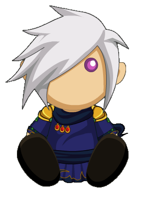

  

<b>PONYTOWN MAFIA RULEBOOK</b>
  
---

unfinished. however, checkout:

<a href="https://pony.town/">Ponytown</a> ! <a href="https://www.aq.com/">Adventure Quest Worlds</a> ! <a href="https://www.townofsalem.io/">Town Of Salem</a>

yes i credited aqw because of the character i use. they are from aqw. i like aqw

# ROLES

  
$\textcolor{green}{GOOD}$

   <li><b><ins>Doctor:</b></ins> Heal one person each night. (Anyone that was injured or poisoned have 3 days/nights to be heal by the doctor before they die.)</li>
  <li><b><ins>Bodyguard:</b></ins> Protect one person from death each night. If the person who you protected is attacked, you and the attacker will die.</li>
  <li><b><ins>Jailor:</b></ins> You will choose one person to talk to in private, blocking their action for the night. You can choose to free or kill them, until time runs out. *JAILOR WILL REMAINS ANONYMOUS, THEIR MESSAGES WILL BE SEND THROUGH THE HOST!*</li>
  <li><b><ins>Investigator:</b></ins> Investigate one person each night for a clue to their role.</li>
  <li><b><ins>Sheriff:</b></ins> Check one person each night for their activity. You have 1 bullet. If you already check someone, you cannot use your bullet on the same night!</li>
  <li><b><ins>Vigilante:</b></ins> Every night, you gain a bullet. Try to find the mafia and kill them. If you killed 2 innocents, you will die. (Max bullets: 3)</li>
  <li><b><ins>Veteran:</b></ins> Stay alert at night, deals a powerful attacks to anyone visiting/targeting them, killing the visitors, no matter who they are. (2 Uses)</li>
  

  
$\textcolor{red}{BAD}$

  <li><b><ins>Godfather:</b></ins> Give orders to the mafia AND/OR kill someone each night.</li>
  <li><b><ins>Mafia:</b></ins> Take orders from the godfather, if order is not given, they're free to kill someone. If the godfather dies, they will become the godfather.</li>
  <li><b><ins>Consigliere:</b></ins> Work with the godfather. Check one person for their EXACT role each night.</li>
  

  
$\textcolor{yellow}{NEUTRAL}$

  <li><b><ins>Jester:</ins></b> Fool people during discussion and get voted out. Jester will win if they get voted out!</li>
  <li><b><ins>Alchemist:</ins></b> Poison someone each night. Target will have 2 days to be cured before they die.</li>
  <li><b><ins>Serial Killer:</ins></b> Kill someone each night. This role have to try to kill everyone, no matter who they are.</li>
  

 
  
 

